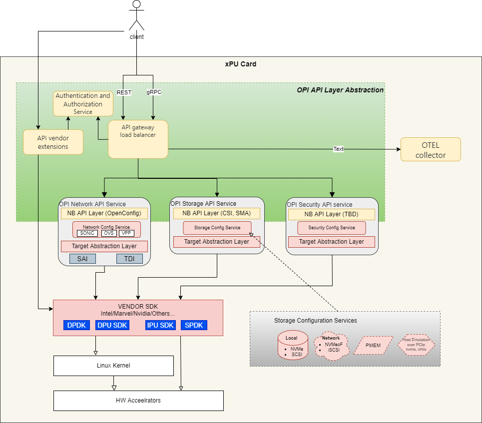

# Use Cases

## Usage Deployments - Capabilities desired by end users

- Virtual Switch Offload
- Network Service Offload
- NVMeoF
- Storage Offload/Services
- Firewall/Distributed Firewall
- ...

## Phases of Operation - API considerations

- Pre-provisioning
- Day 0 (Initial Startup)
  - Discovery
  - Initial Provisioning
- Day N
  - Re-provisioning
  - Firmware Update
  - OS Update
  - Retirement

## Interfaces

- Configuration Interface
  - Network facing (Ethernet inband or out-of-band)
  - Host facing (Network port over PCIe)
  - BMC facing (for systems with integrated BMCs)
- Consumption Interface
  - Virtual Function
    - Network VF Interface
    - Virtual Storage (VF Interface)

What would the AI/ML consumption interface look like?
What are the Security implications on consumption interfaces?
What are the Security API boundary implications to create the air gap?

## API Abstraction Layer

The API Abstraction Layer provides the interface set for the capabilities provided by the xPU.  This abastraction layer consists of two areas; specifically, a control plane layer to address the configuration aspect and a data plane layer which provides the information flow for the configured capabilities.

### Control Plane Layer

  At a high level the control plane of the abstraction layer is essentially a shim that has the gateway function, a fan-out mechanism for the specific configuration capability, and the protobuf definitions that are used for the configuration.  Separately there is a vendor extension interface to allow for a direct connection to the SDK functions.

  

  A detailed conceptial diagram below illustrates the deployment on the local xPU where the API gateway and load balancer which provides the gRPC/REST interface to the client (client can be an orchestration agent).  As part of the abstraction layer, the Authentication and Authorization service is needed to verify the user/agent access and authorization for the service.

The direct access to the SDKs is supported via a separate connection from the client thru the API vendor extensions (which may be a pass-thru) to the functions available.

The API gateway would parse the specific payload information to the particular service function as well as provide instrumentation information to the OTEL collector.  The parsed payload would align to the northbound API (configuration interface) of the service.

The particular configuration service functions would handle the service operations based on the configuration requested and utilize the TAL (Target Abstraction Layer) to interface to the particular SDK for the D/IPU platform.

## Building Blocks

- gRPC
- ProtoBufs
- VF/PF
- Access Security

## Use Case Examples

### Network Services Offload

The Network Services Offload use case will build a foundation for the examples that can be put together for the OPI.  The basic topology is shown in the diagram.  It consists of two servers, with D/IPUs that are connected through a network switch.

The network switch provides a mechanism to provide any debugging and analysis of the traffic on the network connection.  Each server contains a DPU with its network interface.

Subsequent use cases can be built upon the network services offload.

### Storage Services Offload

The basic topology is shown in the diagram.
It consists of SAN/NAS (Network Attached Storage) Array/Applience/Controllers or JBOF/EBOF and a Initiator server, with D/IPUs that are connected through a network switch.

### VNIC and NVME Offload
The diagram below shows the packet pipeline and packet processing layers and their attachment points. This diagram illustrates points of convergence between VNIC and NVME Offloads and elements of security are different attachment points and all these paths are required at the same time. The chaining of various packet processing stages such as bridging, tunneling, encryption dictates the table configurations required at each processing stage.

The table below provides the datapaths where each one has a specific objective and combining all of these objectives results in the above diagram.
|   | Objective    | Datapath Service Chain                                        |
| - | :--------    | :---------------------                                        |
| 1 | Basic NIC    | Host ↔ VNIC ↔ IP ↔ Eth ↔ Wire                                 |
| 2 | + VLAN       | Host ↔ VNIC ↔ IP ↔ VLAN ↔ Eth ↔ Wire                          |
| 3 | + Tunnel     | Host ↔ VNIC ↔ VxLAN ↔ IP ↔ VLAN ↔ Eth ↔ Wire                  |
| 4 | + L3Security | Host ↔ VNIC ↔ VxLAN ↔ IP ↔ IPsec ↔ VLAN ↔ Eth ↔ Wire          |
| 5 | + MultiHost  | Host ↔ VNIC ↔ Bridge ↔ VxLAN ↔ IP ↔ IPsec ↔ VLAN ↔ Eth ↔ Wire |
| 6 | NVMe + Local | Host ↔ NVMe ↔ Local Disk                                      |
| 7 | NVMe + TCP   | Host ↔ NVMe ↔ NVMe-i ↔ TCP ↔ IP ↔ Eth ↔ Wire                  |
| 8 | + L4Security | Host ↔ NVMe ↔ NVMe-i ↔ TLS ↔ TCP ↔ IP ↔ Eth ↔ Wire            |
| 9 | + VLAN       | Host ↔ NVMe ↔ NVMe-i ↔ TLS ↔ TCP ↔ IP ↔ VLAN ↔ Eth ↔ Wire     |
