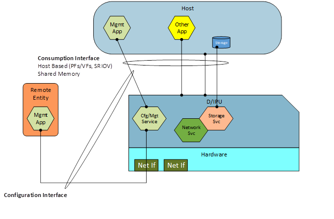

# Open Programmable Infrastructure API and Behavioral Model Group

Meeting: Every Thursday at 12:00 - 1:00 ET (9:00 -10:00 PT)

---
Minutes 3/3/2022

Attendees: Prasun Kapoor, Ted Streete, Boris Glimcher, Gokul Kandiraju,
Kyle Mestery, Mark Sanders, Wayne Hineman

Agenda:

- Review Layering Diagrams
- Discuss Capabilities Classification

Notes:

- Overview of various Layering Diagrams for thoughts by the teams
  - Include Chaining of the Services
  - Create higher level view of the Layering, prior to the more detailed diagrams
- Capability Classification Matrix
  - Review this in the aspect of a Service view vs a Capability view of the functionality
  - Split the capability and Service views where the service may use a capability
  - Performance points of the services and the chaining of the service/capabilities
  - Need to define views for
    - Services
    - Capabilities
    - Chaining

Actions:

- All: work on defining the Services, Capabilities, and possibly Chaining view
- Create location on GitHub for the brainstorming.

Diagrams:

---
Minutes 3/10/2022

Attendees: Prasun Kapoor, Ted Streete, Boris Glimcher, Mark Sanders, Wayne Hineman, Gene Bagwell, Navad Haklai, R Sarma Burugula, Satananda Burla

Agenda:

- Discuss Capabilities Classification

Notes:

- Capture Service Chaining -- is it a capability or something else?
  - Utilize the term of a pipeline or service flow -- decide on terminology
  - How does the Pipeline/Chain get created/linked?
  - How does the pipeline/chain get changed?
- Define a policy framework for the pipeline flow.
- Discovery and Advertisement
  - Advertisement and Publishing of capabilities
- Location for the starting capabilities document
    <https://docs.google.com/spreadsheets/d/1IBCS1a2R23Ehc4CYypzvX8GfwZXDO7Wm/edit#gid=488964010>
- Will cancel next weeks meeting due to the OPI Event

Next Meeting Topics (2 weeks):

- Review updates on the Capabilities Document/Sheet
- Begin API Mapping and Breakdown views discussions

Actions:
These will move into the github issues/discussion area:

- 2/24/2022 -  Define a Layering Diagram for I/DPU Elements - Concept in place
- 2/24/2022 -  Define an Interface diagram view for the I/DPU - Draft
- 2/24/2022 -  Prioritize a top set of APIs to define aligned to the Taxonomy Set
- 3/03/2022 -  Work on defining the Services, Capabilities, and Possible Chaining view.
- 3/03/2022 -  Create a location on GitHub for brainstorming/collaboration - Complete

Meeting Minutes are at:
<https://github.com/opiproject/opi-api/tree/main/doc/minutes>

---
Minutes 3/24/2022

Attendees: Prasun Kapoor, Ted Streete, Boris Glimcher, Mark Sanders, Gene Bagwell, Navad Haklai, R Sarma Burugula, Satananda Burla, Jerin Jacob, Shafiq Abedin, Wayne Hineman, Gokul Kandiraju, Fabrizio D’Angelo, Kyle Mestery, Venkat Mahalinga, Umesh Deshpanti

Agenda:

- Discuss Github location and use of Issues/Discussion for Brainstorming, collaboration, and Actions
- Prioritize top Set of APIs to focus workstream on
- Discuss Capabilities Classification <https://docs.google.com/spreadsheets/d/1IBCS1a2R23Ehc4CYypzvX8GfwZXDO7Wm/edit#gid=488964010>
- Review/Discuss API protocol mechanisms – gRPC, etc.

Notes:

- Bring up the Discussions section of the Github to the broader DB/OPI teams for how to track the various information that is being worked across the teams.
- Prioritization of APIs
  - Define the Infrastructure Use Cases and align to the Needs in the API
    - Advertisement of Capabilities is key
    - Is Networking basis a key component across the various use cases? - Yes
    - Is Security a key component across the various use cases? – Yes
    - Is Storage a key component across the various use cases?
  - Get a broad agreement of the capabilities is a first step.
  - Style of API to use – REST for some types, gRPC for some types – provide recommendations.
    - Define the Request and Response structure
      - Base Framework Definition
    - GraphQL instead of REST (Thumbs up)
  - Utilize existing APIs that are in place and extend where capabilities are missing
  - Look at the view of Dataplane and Control Plane

Actions:

- Setup formal mailing list for the group – github, etc.
- Add notifications for the github for updates/changes to the repo.
- Add guidelines for the development/spec creation for the contributions to the repo.

Upcoming Meeting Topics:

- IPDK Interfaces Walk Through (next week) – Dan Daly (Intel)
- DPDK Interface Walk through (2 weeks from now) – Jerin Jacob (Marvell)

---
Minutes 3/31/2022

Attendees: Prasun Kapoor, Ted Streete, Boris Glimcher, Mark Sanders, Dan Daly, Navad Haklai, R Sarma Burugula, Satananda Burla, Jerin Jacob Kollanukkaran, Shafiq Abedin, Wayne Hineman, Steven Royer, Fabrizio D’Angelo, Kyle Mestery, Venkat Mahalinga, Umesh Deshpande, Tim Michels, Matthew Jean, Michal Kalderon, Venkat Pullela, Yuval Caduri

Agenda:

- Dan Daly to present IPDK and walk through the interfaces

Notes:

- Overview of IPDK <https://ipdk.io/>
- Walk through of Target Abstraction Interface
  - Fixed Table views in the TDI (Table Driven Interface) for the networking capabilities
  - Lookaside and Inline TLS capability will need to be defined
  - Placeholders for the Storage, Crypto, Compression, Key Storage, etc.
- Walkthrough of the Infrastructure Application Interface
- Storage interface capabilities is an open area.

I have setup a distribution list for the group, please check to see if you identify anyone who is missing from your knowledge in the distribution (To) line.

I have enabled (with the help of Kyle) the notification from github to the Slack Channel.  This should provide an update when any push events occur to the repository and is supposed to provide notifications of discussion thread updates to allow their use (I have not tested that aspect yet)

Actions:

- Add guidelines for the development/spec creation for the contributions to the repo.

Upcoming Meeting Topics

- DPDK Interface Walk through (next week 4/7/2022) – Jerin Jacob Kollanukkaran (Marvell)
