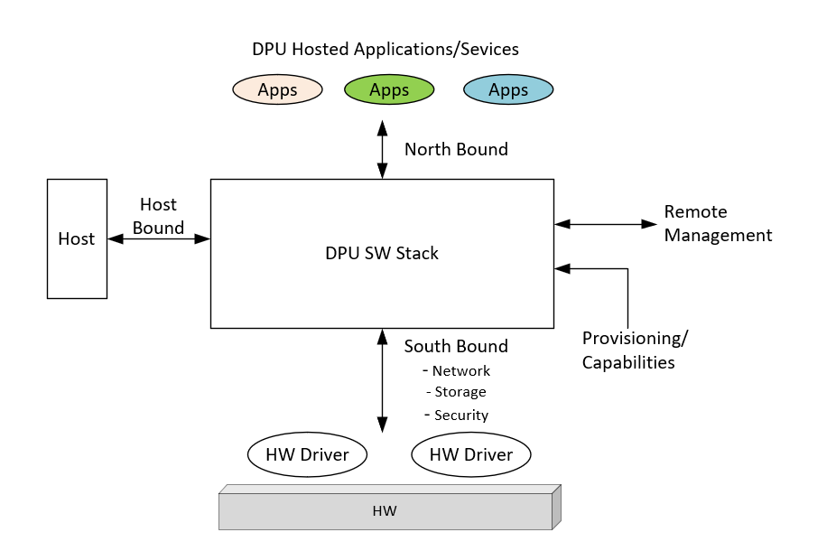
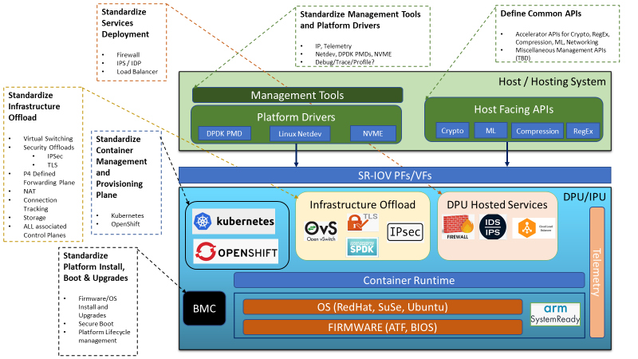

# Open Programmable Infrastructure API and Behavioral Model Group

Meeting: Every Thursday at 12:00 - 1:00 ET (9:00 -10:00 PT)

---
Minutes 3/3/2021

Attendees: Prasun Kapoor, Ted Streete, Boris Glimcher, Gokul Kandiraju,
Kyle Mestery, Mark Sanders, Wayne Hineman

Agenda:

- Review Layering Diagrams
- Discuss Capabilities Classification

Notes:

- Overview of various Layering Diagrams for thoughts by the teams
  - Include Chaining of the Services
  - Create higher level view of the Layering, prior to the more detailed diagrams
- Capability Classification Matrix
  - Review this in the aspect of a Service view vs a Capability view of the functionality
  - Split the capability and Service views where the service may use a capability
  - Performance points of the services and the chaining of the service/capabilities
  - Need to define views for
    - Services
    - Capabilities
    - Chaining

Actions:

- All: work on defining the Services, Capabilities, and possibly Chaining view
- Create location on GitHub for the brainstorming.

Diagrams:

