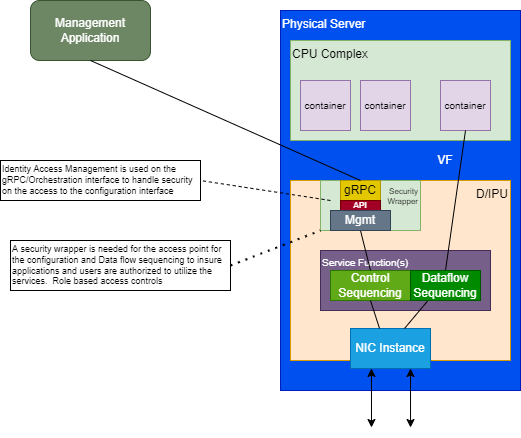

# Open Programmable Infrastructure API and Behavioral Model Group

---
Minutes 5/05/2022

Attendees: Mark Sanders, Steven Royer, Wayne Hineman, Raja Kommula, Dan Daly, Patty Driever, Umesh Deshpande, Ted Streete, Satananda Burla, Venkat Pullela, Kyle Mestery, R Sarma Burugula, Shafiq Abedin

Agenda:

- Review Use Case Concept Diagram

Diagrams discussed:
These diagrams are editable by importing into draw.io

Use Case Diagram

High Level Diagram

Notes:

- Include the security construct around the services/containers
  - Put a security wrapper around the Control Plane aspect.  The Control plane can be any control aspect such as Networking, Storage, Crypto, etc. functionality.
- Identity Management controls on the security.
- P4 Portable NIC architecture inclusion and review in the context of the frameworks for the API and translation aspects.
- Define a model of Service Chaining for the Infrastructure
  - A line of functions that are sequenced in the flow of the pipeline that goes from the CPU VF to the Network interface processing. – “flow sequence”
  - Sequencing the Data Path – “Data flow sequencing”
  - Independent Control Planes – “Control sequencing”
- ONF Generic gRPC server that was part of Stratum that may be leveraged.  This is open sourced.
- Table driven approach for the primitive definitions with the models of the functionality.
- Translation layer as part of the management block that would move the schema to a table driven interface toward the control plane aspects.

Actions:

- Diagram updates for the draw.io from the meeting are included.
- Build out Generic gRPC server basis.

Upcoming Topics:

- Lifecycle Management API discussion
- Security, Attestation API discussion
