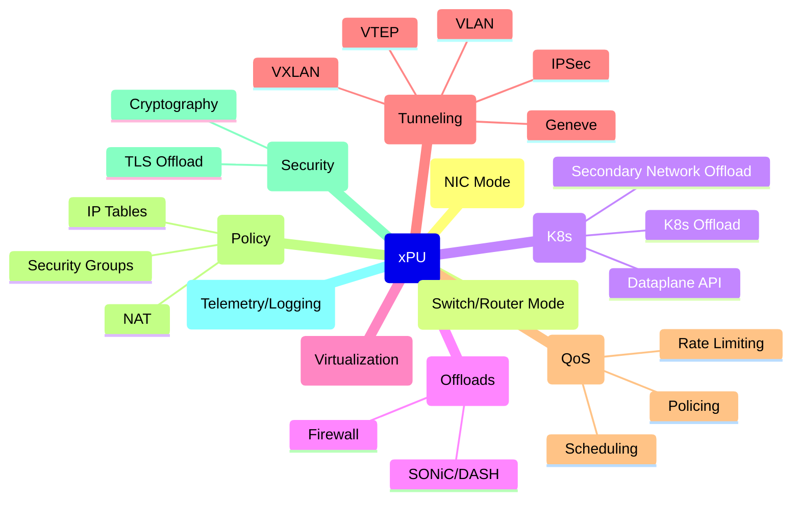
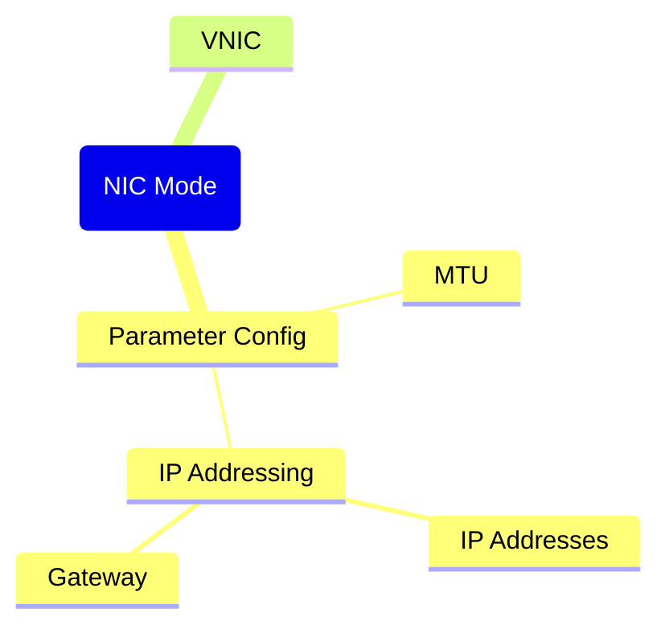
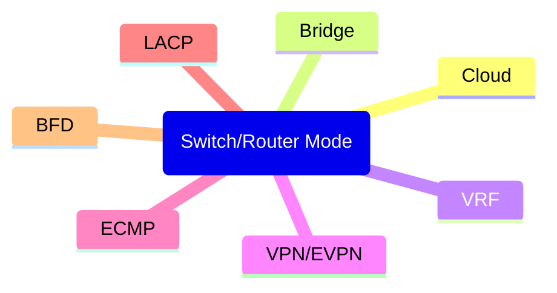
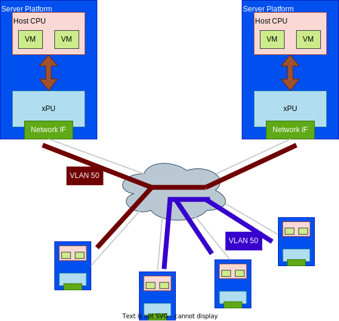
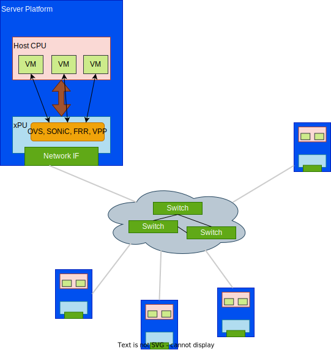
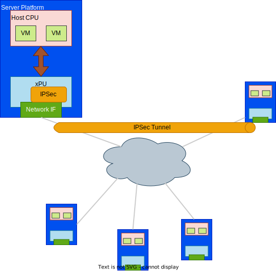
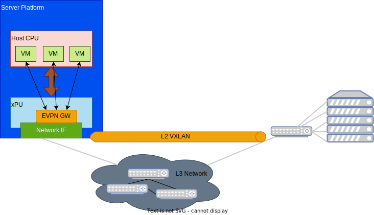
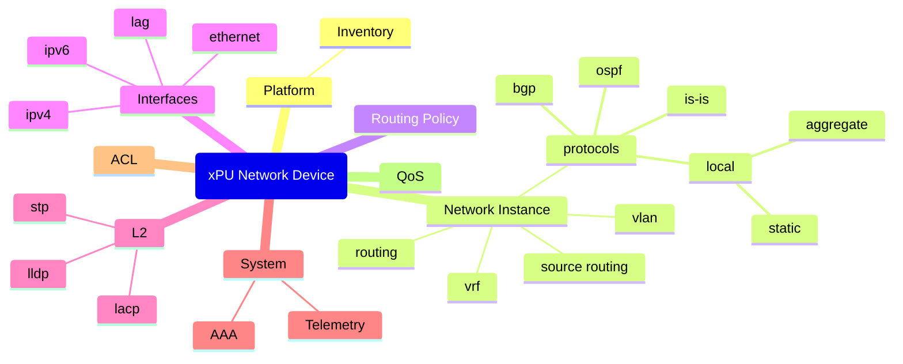

# OPI Network APIs

## Network API Objectives and Goals

- OPI defines/recommends __protobuf__ definitions that each vendor can tie into the underlying SDKs.
- The __protobuf__ definitions will be aligned with the API and behavioral models available from OVS DB, OpenConfig, OpenFlow, P4, etc. to allow configuration of the service.
- OPI provides a __LAN service__ implementation for the network capabilities that is compatible with OVS, SONiC, VPP, P4, etc.
- OPI defines a __device interface__ for the data services that are delivered through the the PF/VF from the xPU.
- OPI provides a __prototype client__ for sending gRPC, REST protobufs to the xPU for configuation and management.

## Network APIs to be defined

At a core level there are two network APIs that need to be defined

- __Configuration and Orchestration__
- __Data Flow__

Additionally, a third API that needs to be considered, __Application__ API.  The Application API supports the ability to provide service chaining between operations within the DPU which may be processed locally or be terminated into the PF/VF to the CPU complex that handles the Container/VMs.

The objective of the API definition is to identify a common programming interface; however, given the various solutions that need to be considered, there may be solution specific APIs for a particular domain.

### Mapping Model

When we look at the capabilities needed by the networking API, we have to consider the high level view of the operations available.  The identified high level groupings of operations/capabilities are illustrated in the diagram below along with a set of more granular settings that fall within the groupings.  The groupings consist of:

- NIC Mode
- Switch/Router Mode
- Kubernetes
- Offload Services
- Network Virtualization
- Tunneling
- QoS
- Policy
- Security
- Telemetry/Logging

Initially the focus needs to define the APIs for NIC mode and the Switch/Router Mode

#### NIC Mode

NIC mode is when the xPU is operating as a NIC.

#### Switch Router Mode

Switch/Router mode is when the xPU is operating as a Switch/Router type of device.

### Basic Capabilities and Behaviors

In general, the ARM processing complex on the xPU can be considered the gatekeeper/control point for the configuration of the interfaces and services that are available on the xPU platform.  This implies that the requests for configuration setup and changes would be coordinated by the configuration management functions in the xPU ARM software.  This also provides a single control point for the configuration actions.

#### Basic Networking

Basic networking needs to consider the mechanisms needed to support applications that are resident on the host compute complex and the ARM compute complex.  The basic capabilities address the operating modes of the xPU such as 1) NIC Mode, where the xPU operates as a NIC, and 2) xPU Mode, where the xPU provides offloaded services and acceleration functions that are beyond a standard NIC.

Additionally, the basic networking has to support the SR-IOV, SIOV, and Bare Metal VF/PF setup and configuration for interfaces.

#### Common Behaviors

At a basic level, the core common behaviors consist of:

  1. Setup the Ethernet links
  2. Expose/Attach links to the Host/ARM
  3. Setup IP Address

With the core common behaviors, the network can be setup in a rudimentary way.  Additional capabilities can then be built upon this common behavior set.

### Considerations

The nework APIs need to consider the various deployment types that can be leveraged with the DPU/IPU solution.  These deployment types consist of, but are not limited to:

- Cloud
- Kubernetes
- Telco

Where each of these solutions may have a common set of API operations and a solution unique set of API operations.

## Network Use Cases

### Basic VLAN

A basic VLAN use case is a VLAN connection between servers through an xPU to allow for container and/or VM applications to interoperate.  The operation should allow for the setup of the flows from the Host compute, container, or VM through the xPU to the remote system.

### Network Offload

The network offload case builds on basic networking capabilities by adding a network service layer in the xPU.  The network service layer is essentially a control plane that supports the slow path functions of learning, routing, etc for networking services.  These services are packages such as OVS, SONiC, FRR, VPP, etc.

### IPSec Tunneling

The basic capabilities can be built on to include IPSec traffic flows for building secure traffic paths and offload.

### EVPN Bridge

The Ethernet VPN (EVPN) allows the connection of distributed sites using a layer 2 virtual bridge.  The virtual L2 bridge is overlayed on a Layer 3 routed network.  Typically this is implemented using a gateway router as the entry point.  With the xPU the connection point can be relocated from the router to the xPU, making it closer to the actual edge computing capability.

## Industry Models

There are industry available API Models that can be leveraged.

### OpenConfig Model

The openconfig model below is a majority subset of the full OpenConfig model set.  Some of the available capabilities (such as WiFi) have been left out since the current xPU cards don't currently have support for those specific operations.

Additional capabilities in the network model are provided by vendor specific extensions with OpenConfig.
