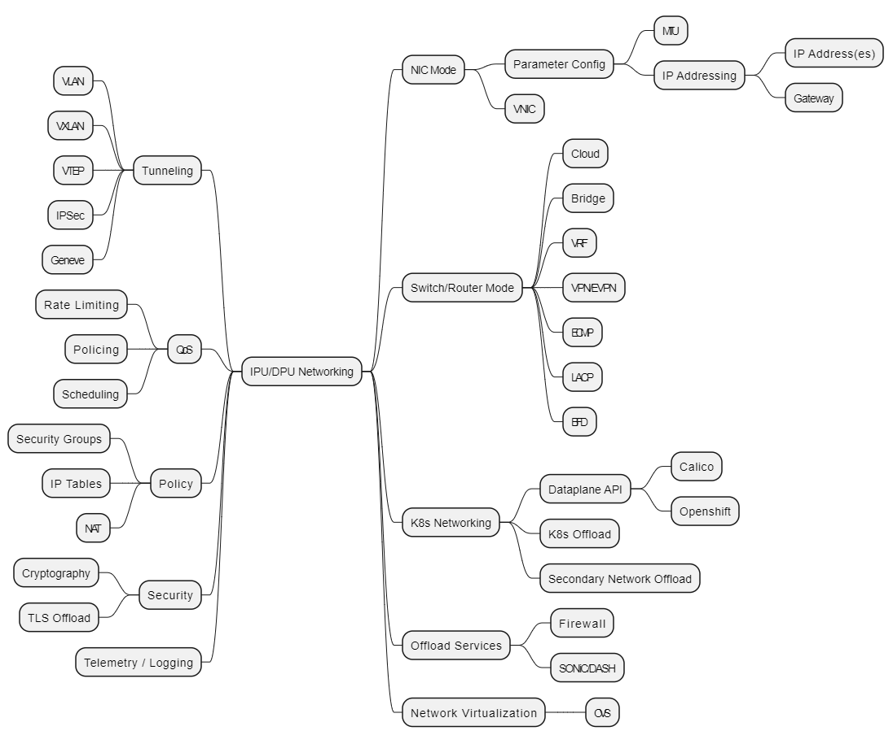
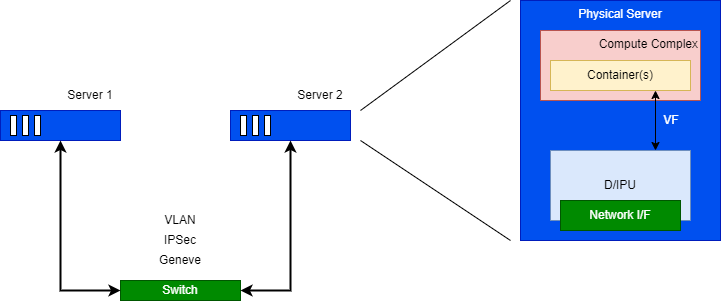

# OPI Network APIs

## Network API Objectives and Goals

- OPI defines/recommends __protobuf__ definitions that each vendor can tie into the underlying SDKs.
- The __protobuf__ definitions will be aligned with the API and behavioral models available from OVS DB, OpenConfig, OpenFlow, P4, etc. to allow configuration of the service.
- OPI provides a __LAN service__ implementation for the network capabilities that is compatible with OVS, SONiC, VPP, P4, etc.
- OPI defines a __device interface__ for the data services that are delivered through the the PF/VF from the xPU.
- OPI provides a __prototype client__ for sending gRPC, REST protobufs to the xPU for configuation and management.

## Network APIs to be defined

At a core level there are two network APIs that need to be defined

- __Configuration and Orchestration__
- __Data Flow__

Additionally, a third API that needs to be considered, __Application__ API.  The Application API supports the ability to provide service chaining between operations within the DPU which may be processed locally or be terminated into the PF/VF to the CPU complex that handles the Container/VMs.

The objective of the API definition is to identify a common programming interface; however, given the various solutions that need to be considered, there may be solution specific APIs for a particular domain.

### Mapping Model

When we look at the capabilities needed by the networking API, we have to consider the high level view of the operations available.  The identified high level groupings of operations/capabilities are illustrated in the diagram below along with a set of more granular settings that fall within the groupings.  The groupings consist of:

- NIC Mode
- Switch/Router Mode
- Kubernetes (K8s) Networking
- Offload Services
- Network Virtualization
- Tunneling
- QoS
- Policy
- Security
- Telemetry/Logging

### Considerations

The nework APIs need to consider the various deployment types that can be leveraged with the DPU/IPU solution.  These deployment types consist of, but are not limited to:

- Cloud
- Kubernetes
- Telco

Where each of these solutions may have a common set of API operations and a solution unique set of API operations.

## Network Use Cases

A basic network use case is to provide a LAN/VLAN connection between two servers to allow for container and VM applications to interoperate.

Configuration of the basic use case should consider the ability to setup OVS, SONiC, VPP, and P4 flows through the associated APIs.  Additionally the ability to subscribe to telemetry services such as OTEL is desired to allow for network telemetry information to be delivered.

The basic setup can then be extended to include IPSec traffic flows for building additional services.

## Industry Models

There are industry available API Models that can be leveraged.

### OpenConfig Model

The openconfig model below is a majority subset of the full OpenConfig model set.  Some of the available capabilities (such as WiFi) have been left out since the current xPU cards don't currently have support for those specific operations.

