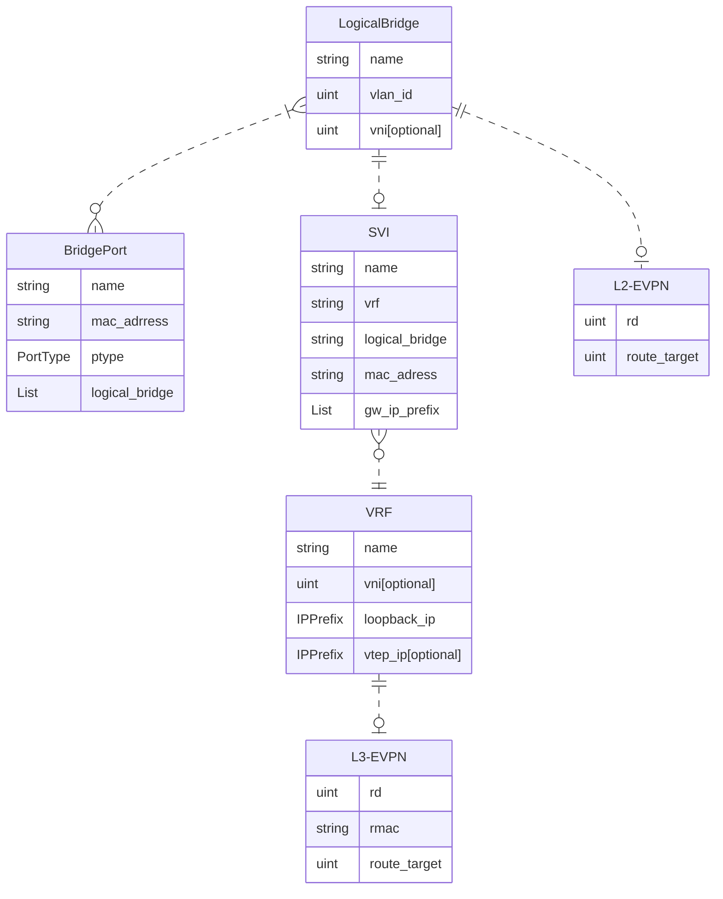
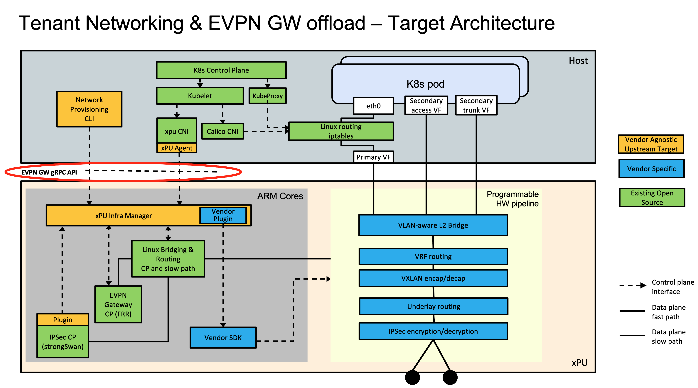

# EVPN Gateway API

EVPN is one of the most well known technologies when it comes to data center networks. It is a Service Provider VPN Technology defined in RFC 8365 as an Internet Standard by the IETF's "BGP Enabled Services" working group. Its flexibility and scalability characteristics allow the interconnection of geographically dispersed sites using layer 2 and layer 3 networking instances.

We present a lean and tailor-made EVPN Gateway API for provisioning integrated L2 and L3 network instances on an xPU, with the option to connect these to L2- and/or L3-VPN instances through an EVPN GW function hosted on the xPU.

## Provision of Tenant VPNs and Networks

Tenant networks are provisioned on the xPU through the EVPN Gateway API, which is realized through gRPC and specified through the Protobuf definitions.

The EVPN Gateway API in the Kubernetes context is used for network provisioning before and after the cluster instantiation, as well as interface configuration during pod creation.

The API works on four object classes: VRF (Virtual Routing Funtions), SVI (Switched Virtual Interface), LogicalBridge and BridgePort. Their relationship is illustrated in the API data model below.

The following objects are managed though the xPU EVPN Gateway API

* **Logical Bridge (LB)**

    Provide L2 forwarding between bridge ports. A logical bridge is a single broadcast domain and corresponds to a single VLAN with its own FDB. The logical bridge gives per VLAN learning.

    A Logical Bridge can optionally be associated with an L2-EVPN instance, which extends the L2 forwarding domain beyond the scope of the single server. The VNI value is used as import and export route target in EVPN BGP as well as in the VXLAN encapsulation of the tunneled traffic.

* **Bridge Port (BP)**

    A bridge port connects a tenant to one or more Logical Bridges. The model supports both access and trunk ports. An access port receives untagged frames from tenants and maps frames to the configured VLAN of a single logical bridge. Trunk ports forward tagged frames transparently for a set of specified VLANs. Within the xPU the packets are forwarded according to their VLAN tag. A trunk port is hence associated with multiple Logical Bridges.

    A typical use case of a bridge port is to configure L2 services for a VF in the host domain. In Kubernetes context a CNI plugin would create the BridgePort and inject the configured VF through a Network Attachment Definition into the Pod

* **Switched Virtual Interface (SVI)**

    An SVI is a virtual L3 interface that connects a logical Bridge to a VRF on the xPU. The SVI has a MAC address on the Logical Bridge and one or more IP addresses in the VRF , which can act as GW IPs for the tenants connected to the Logical Bridge. The GW IPs must be in the same subnets as the Pod IP addresses assigned through the chosen Kubernetes IPAM plugin.

* **Virtual Routing Funtions (VRF)**

    A VRF routes IP packets locally between BridgePorts on LogicalBridges connected through SVIs.

    A VRF can optionally be associated with an L3-EVPN instance to provide L3 connectivity to external nodes. In that case the specified VNI value is used as import/export route target (RTs) in EVPN BGP as well as in the VXLAN encapsulation of the tunneled L3-VPN traffic. The VRF loopback IP address is used as basis for the EVPN route distinguisher (RD).

    The EVPN GW advertises the VRF loopback IP and the subnet prefixes of the connected SVI interfaces as VPN routes to attract traffic. VPN routes imported from BGP are reachable from locally connected BridgePorts.

## EVPN GW offload - Target Architecture

In the image below is depicted the graphical representation of the target architecture.

At the top is the single server host which is running a standard Kubernetes system. This consists of the Kubernetes control plane with Kubelet, standard primary networking realized by Calico cni and kube-proxy. Both Calico cni and kube-proxy are relying on Linux routing and IP tables for providing primary networking locally on that host. Subsequently for external connectivity the host is connected through a primary virtual function (VF) to the xPU.

On top of that in order to accelerate secondary networking a secondary cni (xpu cni) plums in VFs as secondary network interfaces into Kubernetes Pods which are consumed as standard SR-IOV VFs. These VFs can be configured as "Access" type which will give VLAN access to a single network or as "Trunk" type which will give VLAN access to a range of networks. Finally those VFs will be connected to the Physical ports of the xPU through a programmable hardware pipeline. This is the so called fastpath where the packets will flow.

To populate the programmable hardware pipeline with rules a control plane is needed. This runs on the left hand side of the below image on the ARM cores complex of the xPU. The control plane consists of several Open Source components. The first one is the Linux Bridging and Routing control plane which also represents the slowpath implementation of the xPU. Next is the EVPN Gateway control plane which is based on the FRR and is used for the BGP peering and finally is the IPSEC control plane which is based on strongSwan and is used for the IPSEC encryption.

The configuration of the control plane is taken care by a
component that is called xpu infrastructure manager which runs also on the ARM cores complex. The basic funtionality of this component is to configure initially the control plane and then translate the resulting state of the Linux system into forwarding information on the xPU pipeline. A large part of the xpu infrastructure manager is vendor agnostic and only a small part of it is vendor specific and is the one that is used for programming the rules on the xPU pipeline.

As final step the provisioning of networking will take place. This will happen using the EVPN Gateway gRPC API. This gRPC API will be leveraged by a simple cli wrapper but also by the xpu cni which wil program the networking of the VFs that are injected as secondary interfaces into the Kubernetes Pods.

To summarize, the architecture that has been described above allows the deployment of single server solutions where the whole EVPN Gateway functionality is offloaded in a fully programmable xPU NIC.

