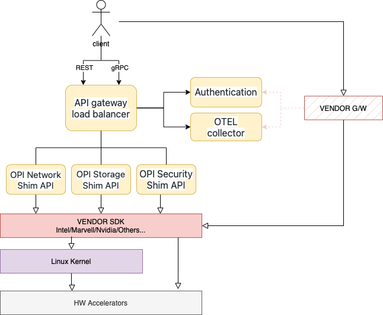

# OPI Security Interface

Authors:

* Kyle Mestery <mestery@mesteyr.com> (@mestery)
* tbd...

## Revision

| Rev  | Date           |  Author             | Change Description                |
|:----:|:--------------:|:-------------------:|-----------------------------------|
| v0.1 |   07/28/2022   | Kyle Mestery        | Initial Draft                     |

## Documentation for Reference

* [strongSwan VICI Protocol](https://www.strongswan.org/apidoc/md_src_libcharon_plugins_vici_README.html)
* [govici](https://github.com/strongswan/govici)

## Terminology

| Term              | Definition                                       |
|-------------------|--------------------------------------------------|
| IKE               | Internet Key Exchange is the protocol used to setup security associations in the IPsec suite. |
| ESP               | Encapsulating Security Payload provides origin authenticity through source authentication, data integrity through hash functions and confidentiality through encryption protection for IP packets. |

## Objective

To define an industry standard "OPI Security Interface" for DPUs and IPUs that
will enable vendors to use the protobuf files from the security API, and expose
those externally and work across a number of orchestration systems. The Storage
solution is one part of a higher-level architecture API defined for DPUs and
IPUs as shown in the following image:

This document focuses specifically on the **OPI Security API Service**.

Auto generated [OPI Security API specification](proto/autogen.md)
