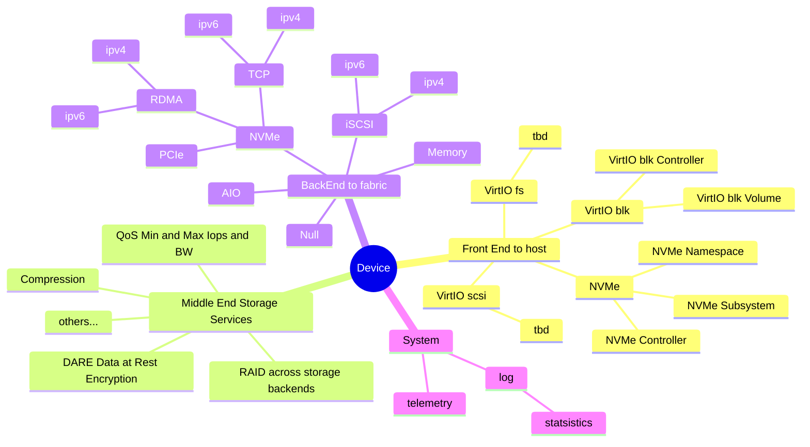

# OPI Storage APIs

## Demos

see <https://github.com/opiproject/opi-poc/tree/main/demos/storage>

## Clients

see <https://github.com/opiproject/pydpu> and <https://github.com/opiproject/godpu>

## Reference implementations

- <https://github.com/opiproject/opi-spdk-bridge>
- <https://github.com/opiproject/opi-nvidia-bridge>
- <https://github.com/opiproject/opi-marvell-bridge>
- <https://github.com/opiproject/opi-intel-bridge>
- AMD (WIP)
- Xsight (WIP)

_All implementations above are reference only and __not__ meant to be used as-is in production_

## Storage API sub-group Goals & Deliverables

### Objectives

- The objective is to define an industry standard “OPI Storage Interface” for IPUs/DPUs.
- This industry standard will enable DPU vendors to develop a plugin once and have it work across a number of orchestration systems.
- The Storage solution is one part of a higher-level architecture API defined for IPUs/DPUs in OPI.

### Deliverables

- OPI defines __protobuf__ definitions that every HW or SW vendor can implement easily using their SDKs
- OPI provides __bridge__ implementation for SPDK because many __(not all)__ companies use SPDK
- OPI provides __CSI-OPI__ driver to hook into k8s
- OPI provides cli based proto __client__ that can send gRPC protobuf messages to DPUs and IPUs for storage defined in the spec above

_All implementations above are reference only and __not__ meant to be used as-is in production_

### Not goals

- OPI storage workstream will not define what workload will run on the exposed devices
- OPI storage workstream will not define nor replace vendors SDKs
- OPI storage workstream will not define how vendors implement gRPC protobuf bridges to their SDKs and cards
- OPI storage workstream will not define how those APIs packaged, deployed, installed, updated and managed
- OPI storage workstream will not define explicit complete defininitive list of storage protocols and accelerators
- OPI storage workstream will not prohibit vendors plugins and extensions

## Implementation

Compile it as:

```bash
docker run --user=$$(id -u):$$(id -g) --rm -v "${PWD}":/defs -v "${PWD}/../common/v1":/common namely/protoc-all:1.51_2 -i /common --lint -d v1alpha1 -l go -o ./v1alpha1/gen/go/  --go-source-relative
```

Linter it as:

```bash
docker run --user=$$(id -u):$$(id -g) --rm --entrypoint=sh -v "${PWD}/../common/v1":/common -v "${PWD}"/v1alpha1/:/out -w /out ghcr.io/docker-multiarch/google-api-linter:1.57.0 -c "api-linter -I /common /out/*.proto --output-format github --set-exit-status"
```

Additional linter:

```bash
docker run --rm -it -v /etc/pki/ca-trust/extracted/pem/tls-ca-bundle.pem:/etc/ssl/certs/ca-certificates.crt -v "$(pwd):/workspace" -w /workspace bufbuild/buf lint
```

Generate [docs](v1alpha1/autogen.md) as:

```bash
docker run --user=$$(id -u):$$(id -g) --rm --entrypoint=sh -v "${PWD}/../common/v1":/common -v "${PWD}"/v1alpha1/:/out -w /out -v "${PWD}"/v1alpha1:/protos pseudomuto/protoc-gen-doc:1.5.1 -c "protoc -I /common -I /protos --doc_out=/out --doc_opt=markdown,autogen.md /protos/*.proto /common/*.proto"
```

Test your APIs even if unmerged using your private fork like this:

```bash
chmod a+w go.*
docker run --rm -it -v `pwd`:/app -w /app golang:alpine go mod edit -replace github.com/opiproject/opi-api@main=github.com/YOURUSERNAME/opi-api@main
docker run --rm -it -e GO111MODULE=on -v `pwd`:/app -w /app golang:alpine go get -u github.com/YOURUSERNAME/opi-api/storage/v1alpha1/gen/go@a98ca449468a
```

## Documentation for reference of other specs

- <https://spdk.io/doc/jsonrpc.html>
- <https://github.com/linux-nvme/nvme-cli>
- <https://www.snia.org/forums/smi/swordfish>
- <https://github.com/spdk/spdk/blob/master/doc/sma.md>
- <https://github.com/container-storage-interface/spec/blob/master/spec.md>

## Common APIs abstraction layer


## Storage Example use case

- Initiator server has a xPU connected to a switch
- xPU handles NVMeoF connection to some remote Network Storage Array on the same network switch
- xPU exposes some emulated interface to host ( Nvme, Virtio-blk, ... )
- xPU handles authentication and encryption as well
- Host is unaware that storage is not local


## Terminology

| Term              | Definition                                                                       |
|-------------------|----------------------------------------------------------------------------------|
| Host              | A physical server where xPU is plugged over PCIe and powered.                    |
| Block Volume      | A volume that will appear as a block device inside the host OS.                  |
| NVMe Subsystem    | holding all other objects in NVMe world                                          |
| NVMe Controller   | responsible for Queues and Commands handlings. Have to belong to some subsystem. |
| NVMe Namespac     | representing remote namespace. Belongs to a specific controller (private NS) or shared between controllers (usually for Multipathing).|
| tbd               | tbd                                                                              |

## Storage APIs

- All storage APIs are following CRUD model (CREATE, READ, UPDATE, and DELETE)
- All storage APIs are gRPC based with protobuf definitions that can compile to many languages
- All storage APIs must have statistics for observability on every level and set
- We identified 3 sets of APIs in Storage:
  - Front End
    - Those are __host__ facing APIs
    - Examples are emulated NVMe devices, Virtio-blk, Virtio-scsi and other block devices
    - The APIs will have all the required properties for NVMe/Vritio specs
    - Object and FS are also considered as part of the scope
  - Middle End
    - Those are __storage services__ APIs
    - They are implemented in DPU and provide with additional storage services (if applicable)
    - Few example: Raid protection, Compression, Encryption, Multipathing, QoS, and others...
  - Back End
    - Those are __network__ facing APIs
    - DPU connects to those devices locally (i.e. pcie) or remotely on the network (iSCSI, RDMA, TCP, IPv4, IPv6, Ceph, S3, NFS, and others...)
    - We do want few devices for debug (null, malloc, delay, error injection)
    - We do want authentication and security while connecing over network (Chap, TLS, IPSEC, ...)
    - Similar to what nvme-connect provides, for example (in a very simplistic way)
- Security
  - We do want to do security
  - For example: CHAP or AVE for iSCSI and NVMe/TCP for authentication
  - For example: NVMe/TLS 1.3 or IPSEC for secure channel (similar for iscsi)
  - We are not considering at this time encrypting PCIe link (emulated devides over PFs and VFs), this might come later on
  - For implementation limitations we are not starting with those, but they are in design considerations
- Alternative Implementations
  - There are several existing implementations to consider (CSI, SMA, ...)

## Mindmap Diagram


