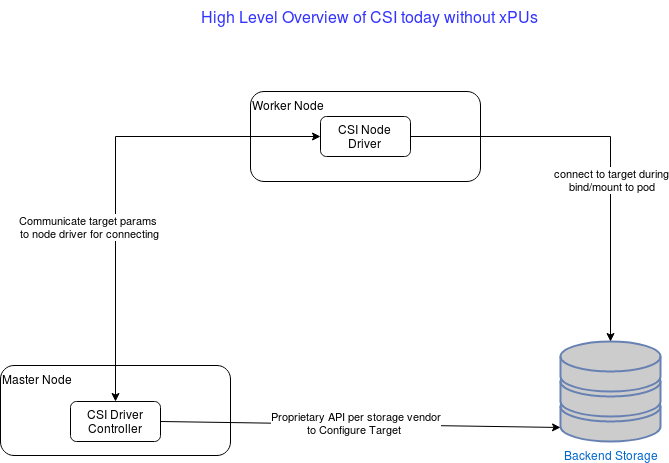
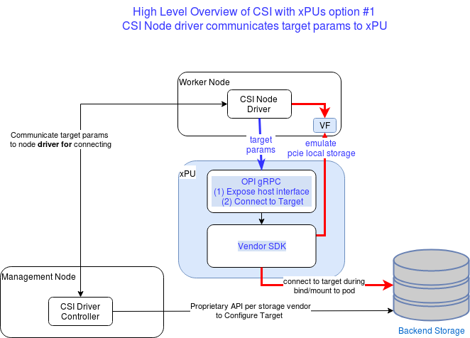
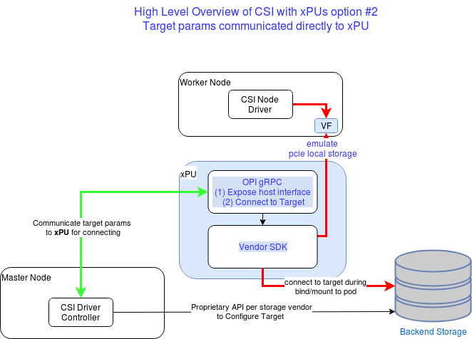
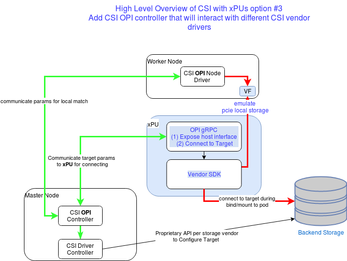

# OPI xPU Aware CSIs

## Scope

Define OPI interfaces and APIs that will enable vendor CSIs driver developers to utilize xPUs in the data-center with one of the main goals being minimal changes to CSI vendor drivers, and a single API for configuring all OPI-compliant xPUs

## High Level Overview of CSI in non-xPU environment

## High Level Overview of CSI with xPU

Once a xPU is added to a host, the xPU will start handling all the communication to the target and offload all storage processing from host to xPU. The xPU will emulate an nvme device to the host which from  host point of view will look as a local nvme device.
The xPU needs to receive remote storage information to enable it to connect to the remote target. There are several ways in which this information can be passed to the xPU. In all cases, there will be some OPI gRPC server on the xPU that will be able to receive these configurations in a standard way ( proto-bufs + gRPC )

### Option 1

The first option is that the CSI Node Driver on the host will continue receiving the connection params as it does today and pass them to the xPU. This will require changes only on the Node driver and not the CSI controller.

### Option 2

The second option is that the CSI Driver Controller will be the one configuring the xPU and the node driver will only be informed of its local nvme device

### Option 3

The third option which is similar to option 2 is to introduce another layer that is the OPI CSI driver controller. This driver will interact with the different vendor specific CSIs and provide translation between them to the xPU to enable connectivity.

