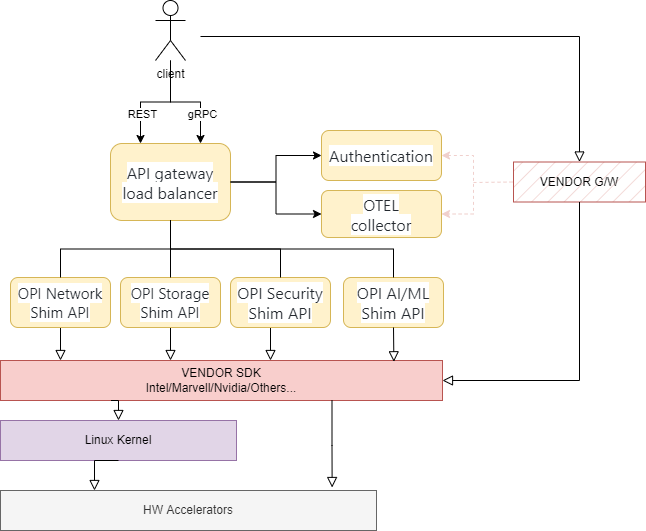
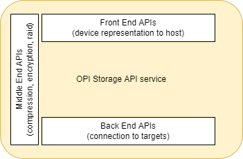
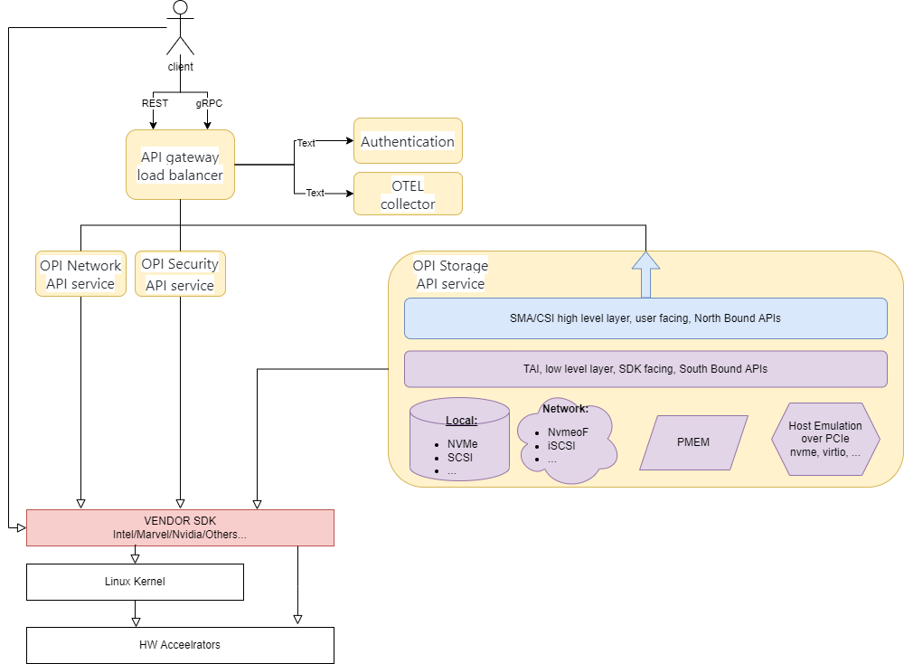
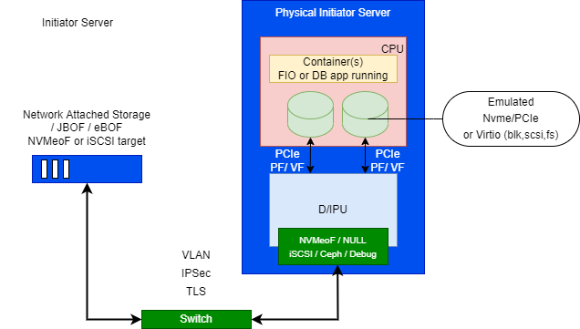
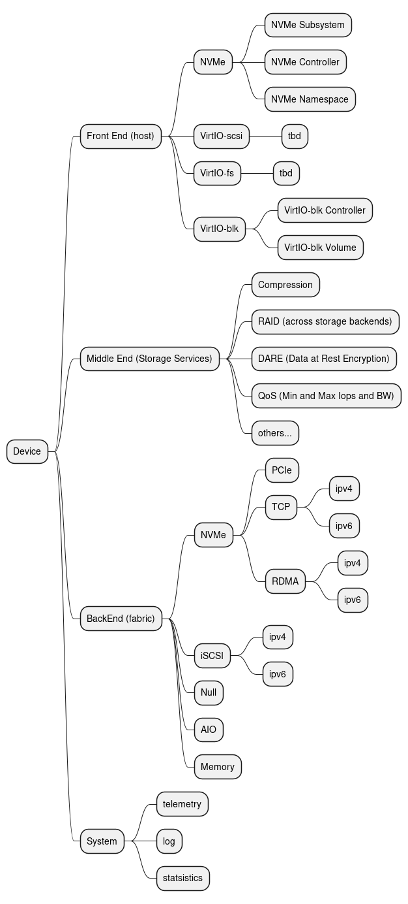
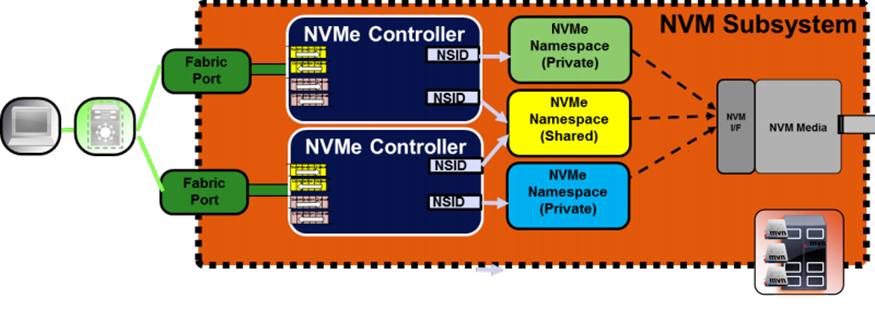

# OPI Storage Interface

Authors:

* Boris Glimcher <<boris.glimcher@dell.com>> (@glimchb)
* tbd...

## Revision

| Rev  | Date           |  Author             | Change Description                |
|:----:|:--------------:|:-------------------:|-----------------------------------|
| v0.1 |   07/24/2022   | Boris Glimcher      | Initial draft. Host emulation, Front End (host-facing) only support NVMe/PCIe; Back End (network-facing) only support NVMe/TCPl; Middle End (Storage Services) - Nothing |
| v0.2 | TBD            | Boris Glimcher      | Front End (host-facing) - adding Virtio-blk;  Back End (network-facing) - adding NVMe/PCIe, NULL; Middle End (Storage Services) - adding encryption |
| v0.3 | TBD            | Boris Glimcher      | Front End (host-facing) - adding Virtio-scsi, Virtio-fs; Back End (network-facing) - adding iSCSI, NVMe/RDMA; Middle End (Storage Services) - adding comptession, raid |

## Documentation for reference

* <https://github.com/spdk/spdk/blob/master/doc/sma.md>
* <https://github.com/container-storage-interface/spec/blob/master/spec.md>
* <https://spdk.io/doc/jsonrpc.html>
* <https://github.com/linux-nvme/nvme-cli>

## Terminology

| Term              | Definition                                       |
|-------------------|--------------------------------------------------|
| Block Volume      | A volume that will appear as a block device inside the host OS.                                                     |
| tbd               | tbd                                              |

## Objective

To define an industry standard “OPI Storage Interface” for IPUs/DPUs that will enable DPU vendors to develop a plugin once and have it work across a number of orchestration systems. The Storage solution is one part of a higher-level architecture API defined for IPUs/DPUs as shown in the following image:

In this document we dive into the **OPI Storage API service**
The storage xPU plugin will provide several sets of APIs detailed later on which can be summarized into three main areas:

* Front-end (host facing APIs)
* Back End (network-facing)
* Middle End (Storage Services)

### Goals in MVP

#### Standardize front-end services

tbd...

#### Standardize back-end services

tbd...

#### Standardize middle-end services

* compression
* encryption
* digest
* etc
Standardize common things that all DPUs should support for example:
* basic compression zlib
* aes-xts
* nvme o tcp tls
* rdma over ipsec,
* t10 dif
* dix etc
* Allow vendors to have their own values not conflicting with OPI to allow vendor specific or bypass options.

### Non-Goals in MVP

tbd...

## Solution Overview

We identified two levels of API here:

* Low level APIs
  * give user more flexibility and more control of what is happening
  * for example, control what PF/VF exactly is used to expose controller ot the host
  * this is similar to <https://spdk.io/doc/jsonrpc.html>
* High Level APIs
  * give user more simplicity then control
  * mostly intent based, like I need protected volume of size x-TB
  * this is similar to PVC (persistent volume claim) in k8s <https://github.com/container-storage-interface/spec/blob/master/spec.md> and in SPDK <https://github.com/spdk/spdk/blob/master/doc/sma.md>

The goal of OPI Storage spec (put this in goals section above) is to provide both levels.

tbd...

### Architecture

This image includes a zoom into the OPI Storage API Service

---

(TBD: maybe better illustration ? )
Initiator server has a xPU which handles NVMeoF connection to Network Storage and exposes some interface to host ( nvme, virtio-blk... ) Host is unaware that storage is not local

---

Following CRUD API (CREATE, READ, UPDATE, and DELETE)

We do want this to be gRPC with protobuf based...

We do want to include statistics for observability on every level...

tbd...

### Security

* For NVMe/TCP or iSCSI (network facing)
  * we can/should use TLS (1.3) for secure channel
  * and Chap-like authentication for PSK generation/exchange
* Clear text From Host to DPU -> may be sniffed/spoofed
  * Ether we can use new PCIe encryption specs
  * Or we can share keys and do SW based encryption on the host and then decryption on DPU/IPU
  * Or we can use NVMeoF (from fiorst point) instead of PCIe based NVMe

### Front End (host-facing)

This DPU emulated devices representation to the host.

* nvme-pcie.proto
* virtio-blk.proto
* virtio-scsi.proto
* virtio-fs.proto

Q: what NVMe spec version we mandate ? 1.3 ? 1.4 ? 2.0 ?

3 Objects are identified on this layer:

* NVMe Subsystem - holding all other objects in NVMe world.
* NVMe Controller - responsible for Queues and Commands handlings. Have to belong to some subsystem.
* NVMe Namespace - representing remote namespace. Belongs to a specific controller (private NS) or shared between controllers (usually for Multipathing).

Auto generated [Specification](proto/autogen.md)

Question(from Marvel): _When is this supposed to be used since there is no way in NVMe protocol for for NVMe subsystem update to be propagated to the host ?_

Answer: _Even in nvme there is no option to update live, one can always bind/unbibd nvme driver to see the change, this is suppose to save delete/add commands_

Question (from Marvel): _Does controller create also involve exposing the Controller to the host on PCIe bus or is that a separate operation ?_

Answer: _Do you see the need to have a separate command for PCIe bus expose? I was thinking this command will expose_

### Back End (network-facing)

This DPU connects to those devices locally (i.e. pcie) or remotely on the network.

* nvme-pcie.proto (for local drives)
* nvme-tcp.proto (rdma and tcp should be together, both for ipv4 and ipv6)
* iscsi.proto
* null.proto (for debug)

Q: do we need same for iSCSI, AIO, NULL, MEM ?
Q: security authentication (chap) ?
Q: auto-discovery ?
Q: custom plugins for custom storage protocols ?

Auto generated [Specification](proto/autogen.md)

### Middle End (Storage Services)

Examples: compression, encryption, EC/Raid, lvm, ...

Auto generated [Specification](proto/autogen.md)
